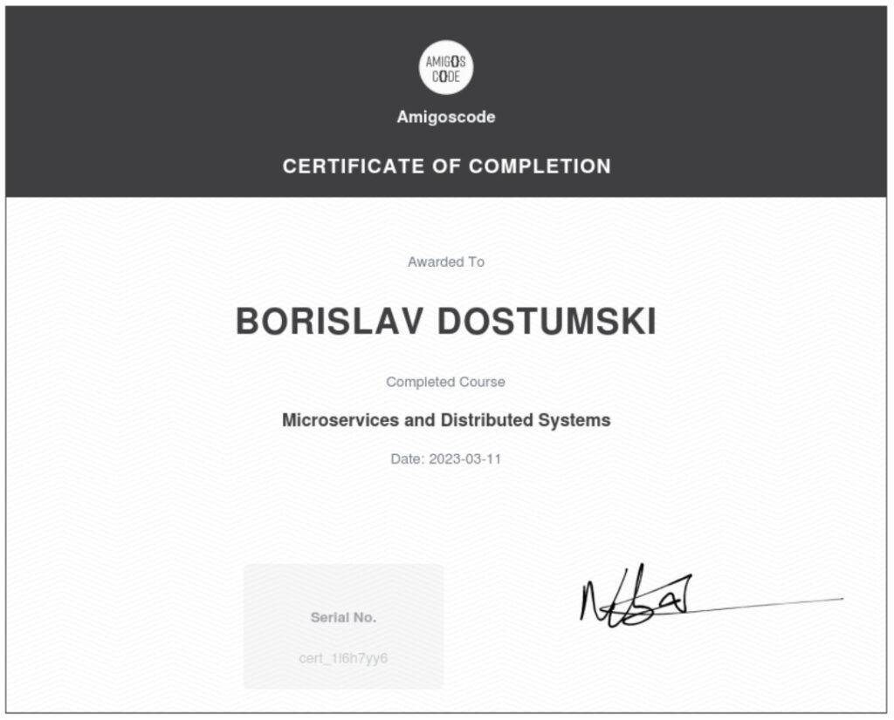

### [Building and Deploying Microservices from scratch](https://github.com/bdostumski/microservices)
- Bootstrap With Maven
- Create Microservices
- Microservice Communication via HTTP
- Service Discovery with Eureka
- Open Feign
- Distributed Tracing
- API Gateway With Spring Cloud Gateway
- Message Queues
- RabbitMQ
- Packaging Microservices to Runnable Jar
- Packaging Jars to Docker Images
- Kubernetes AKA k8s
- Deploying Postgres RabbitMQ and Zipkin to k8s
- Refactoring Microservices for k8s
- Deploying Microservices to k8s
- Managed Kubernetes Cluster with Linode
- Kafka
- Bringing Back API Gateway for Security
- Security – API Key Authentication
