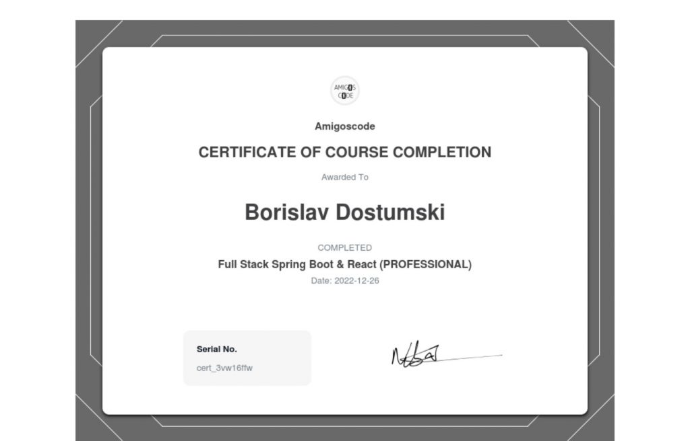

#### [Build and Automate Deployment using Spring Boot | React | Maven | Docker | AWS, and CICD with GitHub Actions](https://github.com/bdostumski/spring-boot-full-stack-professional)
- Spring Boot Backend API
- Front end with React.js Hooks and Functions Components
- Maven Build Tool
- Databases using Postgres on Docker
- Spring Data JPA
- Server and Client Side Error Handling
- Packaging applications for deployment using Docker and Jib
- Software Deployment Automation with GitHub Actions
- Software Deployment Monitoring with Slack
- Unit and Integration Testing
