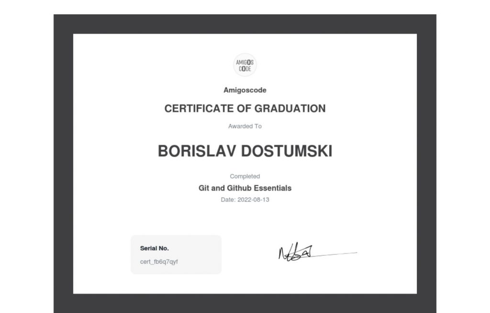
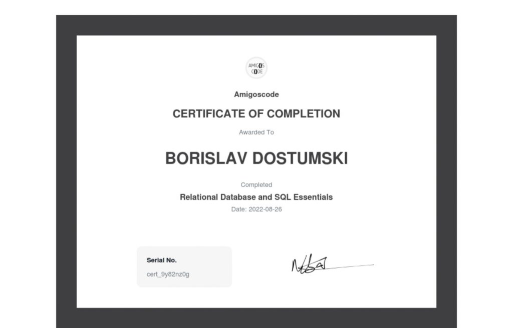
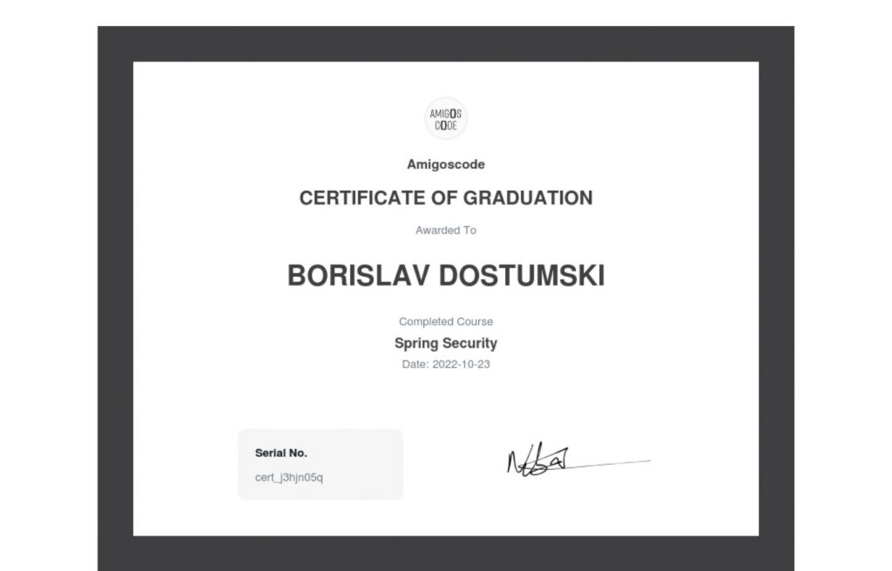
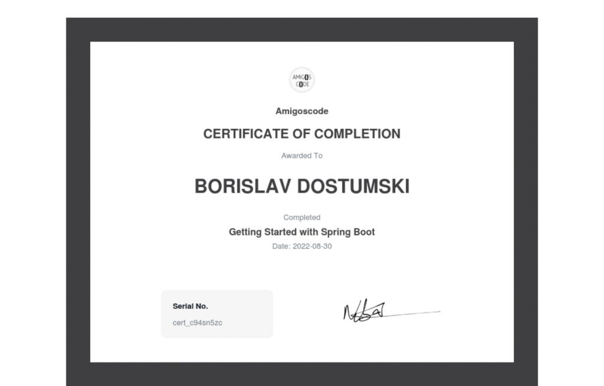
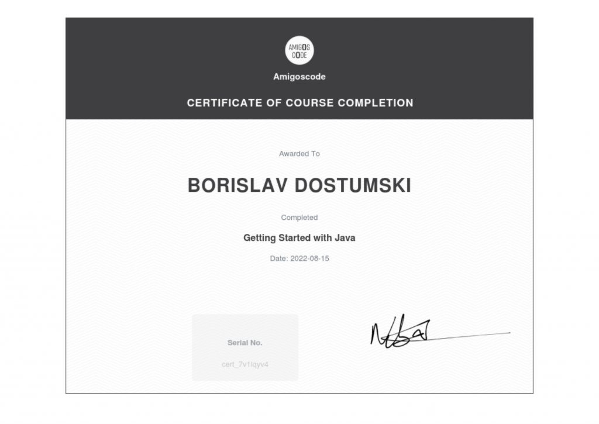
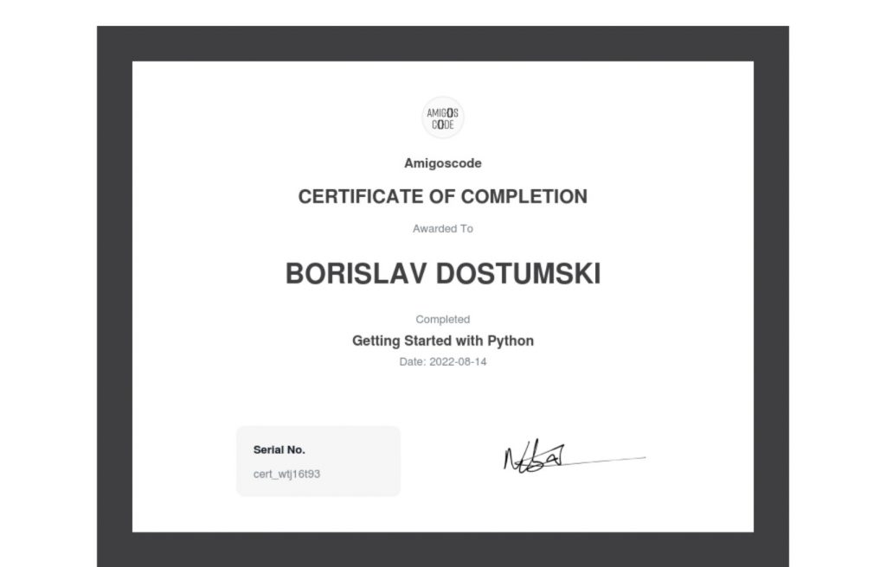

#### Terminal, Bash & VIM Essentials
- Terminal and Shell
- Vim

#### Git and Github Essentials
- What is Git
- Setup Git
- Git commits
- Git branches
- Git push
- Git rebase
- Git merge
- GitHub
- Pull Requests

#### Relational Database and SQL Essentials
- Create Tables
- Create Databases
- CRUD operations
- Filtering Data
- Joins
- Working with Dates
- Aggregate Functions
- Postgres Extensions
- Sequences
- Database Constraints

#### Spring Boot | React | AWS – Upload Images using AWS API
- Spring Boot backend
- React frontend
- Amazon S3 to store files (images)

#### Spring Security
- Getting Started with Spring Security
- Users Roles and Authorities
- Permission-Based Authentication
- Form-Based Authentication
- Database Authentication
- JSON Web Tokens

#### Spring Data MongoDB
- Setup MongoDB running on Docker
- MongoDB Collections and Documents
- CRUD operations using MongoRepository
- Queries using MongoTemplate
- Indexes for unique constraints
- Building a Restful API

#### Getting Started with Spring Boot
- Overview of Spring Boot
- Sring Web MVC
- JSON for Java
- Datbase Connectivity with Spring Data JPA
- Building CRUD API
- Build on practical experience

#### Functional Programming & Java Streams
- What is Java Functional Programming
- Pure Functions
- Lambdas
- Java Functional Interfaces: Function, Suppliers, Consummers Predicates
- Java Combinator Pattern
- Imperative vs Declarative
- Java Streams API: Map, Filter, Reduce, Flatmap, Min, Max
- Java Streams API: Map, Filter, Reduce, Flatmap, Min, Max
- Java Streams API: Map, Filter, Reduce, Flatmap, Min, Max

#### Getting Started with Python
- The Basics
- Operators
- Control Flow
- Data Structures
- Loops
- Functions
- Classes
- Working with Dates
- Working with Files
- Fetching Data from Internet
- Modules

### Master The Best Python IDE PyCharm
 

#### Master The Best Python IDE PyCharm