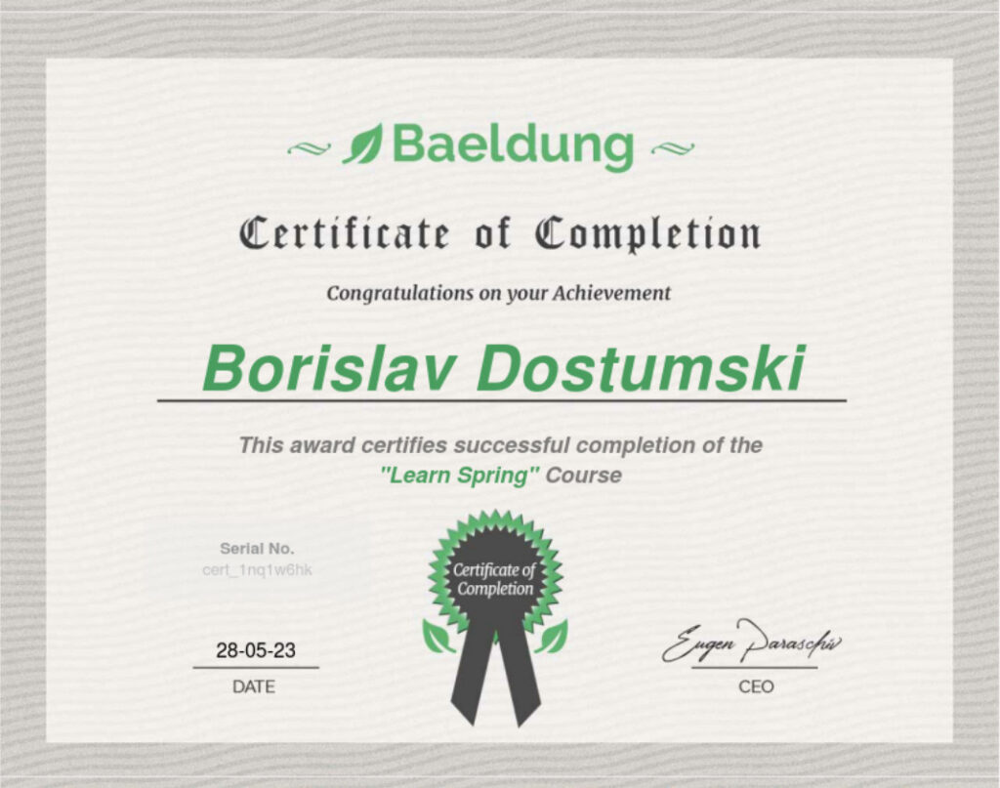

#### Learn Spring
- Module 1 – Getting Started With Spring 5
- Module 2 – Dependency Injection and the Spring Context
- Module 3 – Project Configuration
- Module 4 – Deep Dive Into Spring Boot 2
- Module 5 – Persistence and Data Access
- Module 6 – Web Basics and Spring MVC
- Module 7 – Templating Engines and Spring MVC
- Module 8 – Building a REST API
- Module 9 – Advanced Features in Spring