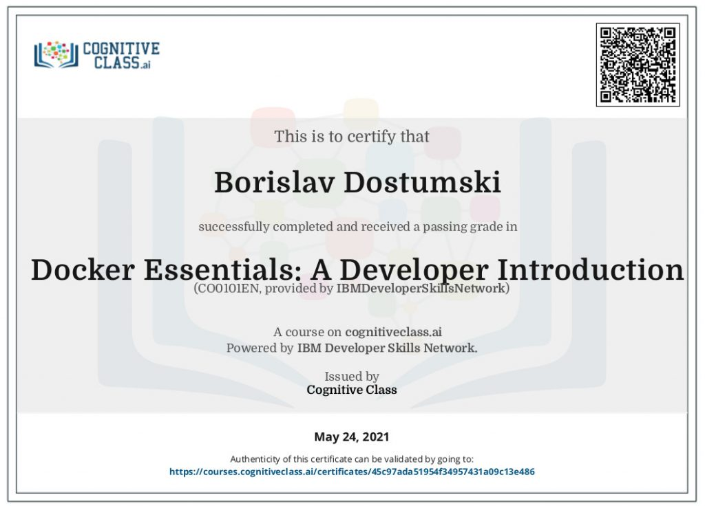

#### In this course, I learned how to use containers for my applications. I started with the basics: creating and running Docker containers, understand the layering and union file system, using best practices when developing Dockerfiles. By the end of the course, I learned how to run containers in production and how to solve problems of advanced orchestration such as high availability, service discovery, and reconciliation.