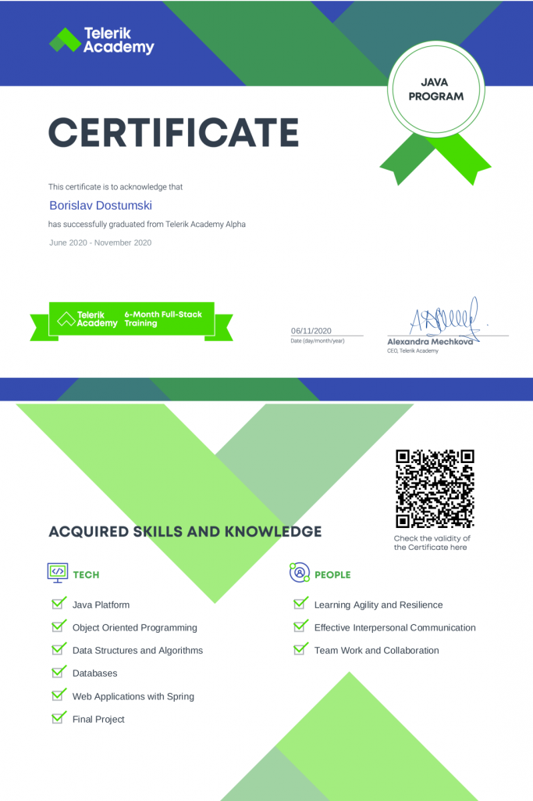

#### During 440+ hours of intensive training, I gain access to key practical knowledge and insights needed to become the next Java developer — advanced Java, object-oriented programming, data structures and algorithms, high-quality code, unit testing, databases, front-end fundamentals, Spring MVC.

#### 20% of the program was dedicated to polishing my soft skills. I develop the ability to manage feedback and expectations, ask the right questions, prioritize, and stick to high-value activities.