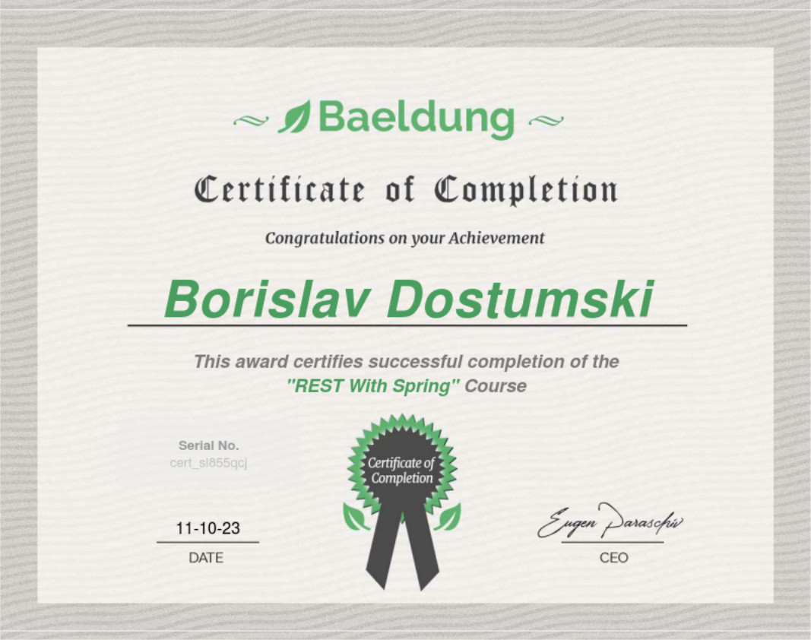

#### Learn Spring REST
- Module 1 – The Basics of REST with Spring
- Module 2 – REST and HTTP Semantics
- Module 3 – Simple Security for REST
- Module 4 – Consuming the API from Angular
- Module 5 – Testing the API
- Module 6 – Advanced API Security: OAuth2 & JWT
- Module 7 – Document, Discover and Evolve the REST API
- Module 8 – Monitoring and API Metrics
- Module 9 – DevOps: CI and CD Pipelines, Deployment 
- Module 10 – Advanced API Tactics
- Module 11 – A Reactive REST API
- Module 12 – New in Spring 
- Module 13 – New in Spring MVC
- Module 14 – Spring Boot
