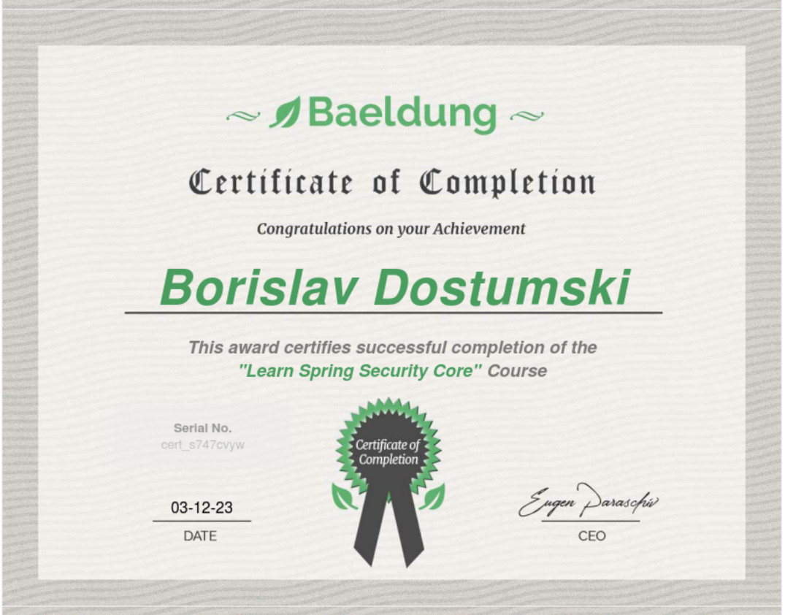

#### Learn Spring
- Module 1 – Secure a Simple Spring MVC Application
- Module 2 – A Full Registration Flow
- Module 3 – Remember Me
- Module 4 – Spring Security on the Client
- Module 5 – Spring Security Expressions
- Module 6 – Password Storage
- Module 7 – Spring Security Advanced Configuration
- Module 8 – Advanced Authentication 1
- Module 9 – Advanced Authorization 2
- Module 10 – Basic REST API Security
- Module 11 – ACL with Spring Security
- Module 12 – Two-Factor Authentication 
- Module 13 – Advanced Spring Security Scenarios 
- Module 14 – Reactive Security
